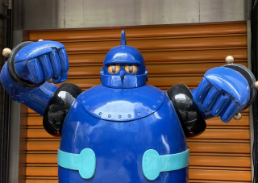

    <button class="tablink" onclick="openPage('Menu1', this)">PROFILE</button>
    <button class="tablink" onclick="openPage('Menu2', this)">INFO</button>
    <button class="tablink" onclick="openPage('Menu3', this)">SKILL</button>
    <button class="tablink" onclick="openPage('Menu4', this)">PROJECT</button>

    

        

            
        

        

            <h3 class="text">MY INTRODUCTION</h3> 
            안녕하세요! 저는 이현규입니다.  
            웹 개발 분야에서 끊임없이 새로운 기술을 배우고, 이를 통해 자신을 계속해서 성장시켜 좋은 웹 개발자가 되고싶습니다.
            <h3 class="text">MBTI : INFJ</h3> 
            철저한 계획성과 높은 헌신도를 통한 업무 효율성 증가  
            뛰어난 창의력과 직관력을 이용한 뛰어난 문제해결 능력  
            타인을 이해하고 파악하는 능력을 통해 어디든 어울리는 사람
        

    

    

        

            <h3 class="text">Birth</h3>
            
2000.09

        

        

            <h3 class="text">Phone</h3>
            
010-9101-8806

        

        

            <h3 class="text">Adress</h3>
            
경기도 수원시

        

        

            <h3 class="text">Email</h3>
            
dlgusrb1596@naver.com

        

        

            <h3 class="text">Major</h3>
            
백석대학교 정보보호학 전공

        

        

            <h3 class="text">Github</h3>
            
<a href ="https://github.com/hkyuuu00" id = "git">hkyuuu00</a>

        

    

    

        

        

            
            

                
HTML  ★★★★☆

            

        

        

            
            

                
CSS  ★★★★☆

            

        

        

            
            

                
JavaScript  ★★★☆☆

            

        

        

            
            

                
PHP  ★★★★☆

            

        

        

            
            

                
MySql  ★★★★☆

            

        

        

            
            

                
React  ★★☆☆☆

            

        

        

            
            

                
Node.js  ★★☆☆☆

            

        

        

            
            

                
Jquery  ★★☆☆☆

            

        

        

            
            

                
Python  ★★★☆☆

            

        

        

            
            

                
Github  ★★★☆☆

            

        

        

    

    

    

        

            
            

                
커뮤니티 게시판

            

        

        

            
            

                
키오스크

            

        

        

            
            

                
진행중...

            

        

    

    

